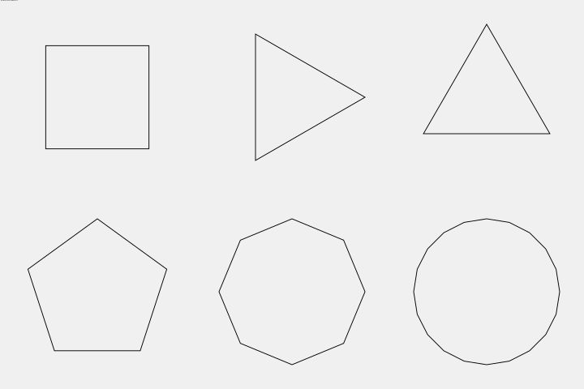
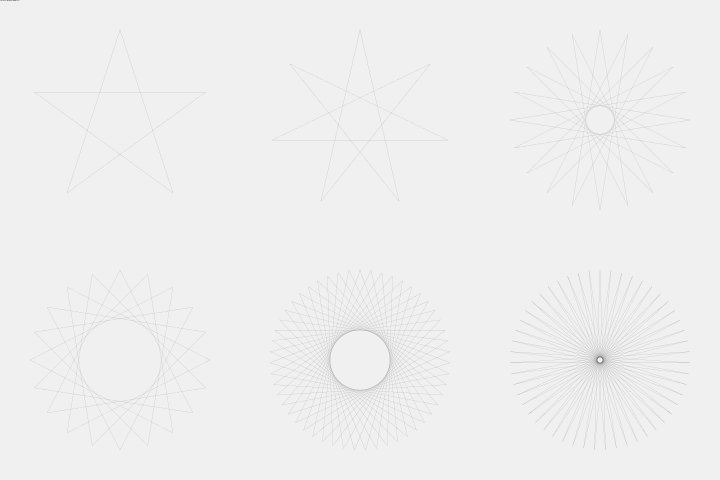
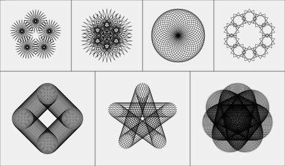
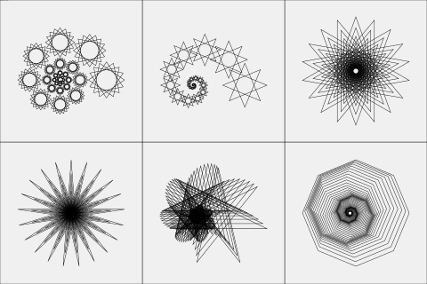
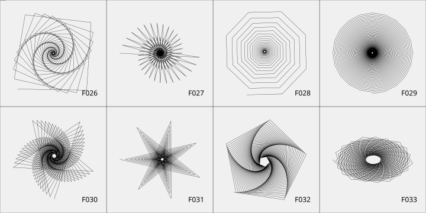
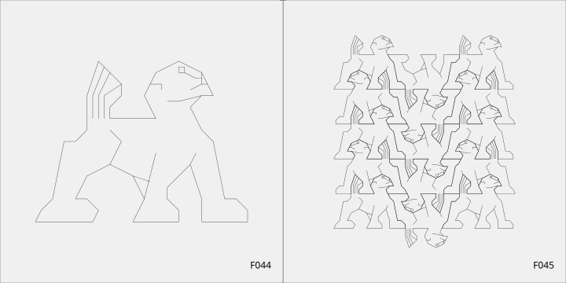
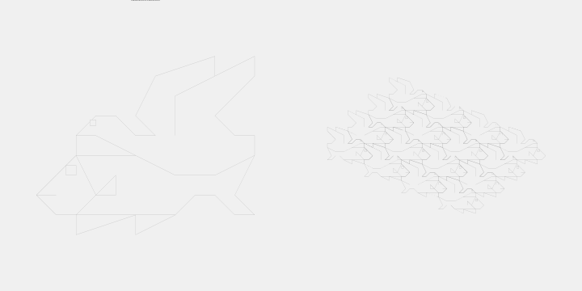
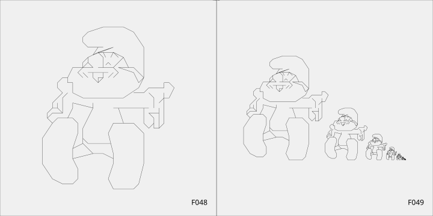
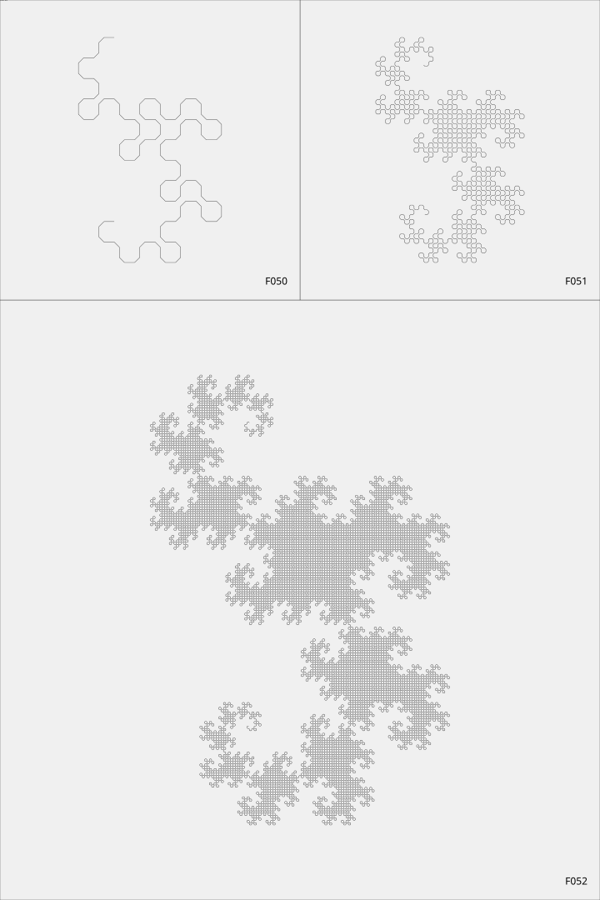
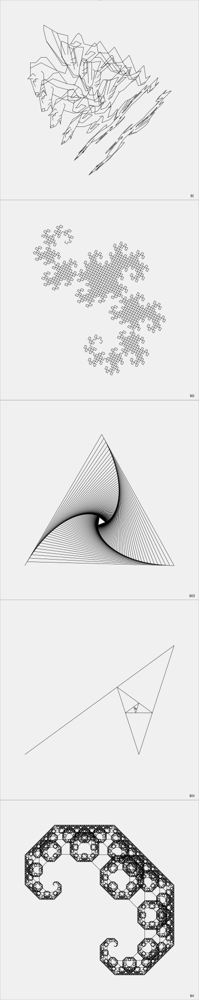

# delahaye-dessins

Recode of the book "Dessins géométriques et artistiques avec votre micro-ordinateur" on Haskell. This code using `diagrams-lib`

## POLYGONES RÉGULIERS

## ÉTOILES RÉGULIÈRES

## COMPOSITION 1

## COMPOSITION 2

## JOLIGONES

## CHEVAL

## LION

## OISEAUX-POISSONS

## SMURF

## DRAGONS

## Bonus

