# delahaye-dessins

Recode of the book "Dessins géométriques et artistiques avec votre micro-ordinateur" on Haskell. This code using `diagrams-lib`.

## POLYGONES RÉGULIERS
<section class="grid">
  <figure class="m4">
    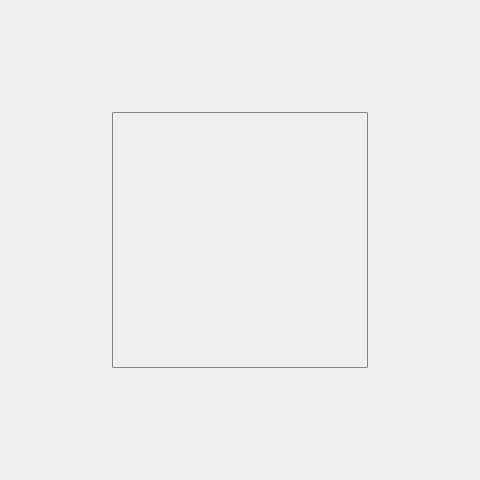
    <figcaption class="num">001</figcaption>
  </figure>
  <figure class="m4">
    
    <figcaption class="num">002</figcaption>
  </figure>
  <figure class="m4">
    
    <figcaption class="num">003</figcaption>
  </figure>
  <figure class="m4">
    
    <figcaption class="num">004</figcaption>
  </figure>
  <figure class="m4">
    
    <figcaption class="num">005</figcaption>
  </figure>
  <figure class="m4">
    
    <figcaption class="num">006</figcaption>
  </figure>
</section>

## ÉTOILES RÉGULIÈRES
<section class="grid">
  <figure class="m4">
    
    <figcaption class="num">007</figcaption>
  </figure>
  <figure class="m4">
    
    <figcaption class="num">008</figcaption>
  </figure>
  <figure class="m4">
    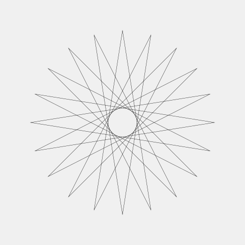
    <figcaption class="num">009</figcaption>
  </figure>
  <figure class="m4">
    
    <figcaption class="num">010</figcaption>
  </figure>
  <figure class="m4">
    
    <figcaption class="num">011</figcaption>
  </figure>
  <figure class="m4">
    
    <figcaption class="num">012</figcaption>
  </figure>
</section>

## COMPOSITION 1
<section class="grid">
  <figure class="m3">
    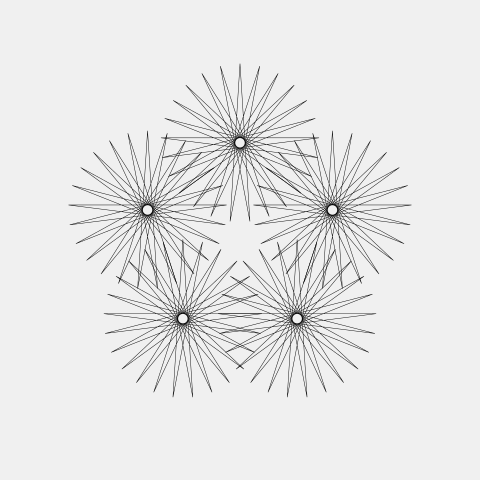
    <figcaption class="num">013</figcaption>
  </figure>
  <figure class="m3">
    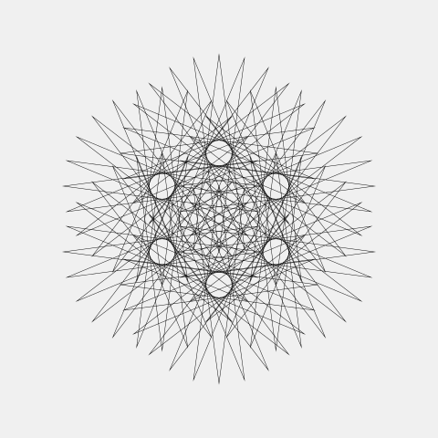
    <figcaption class="num">014</figcaption>
  </figure>
  <figure class="m3">
    
    <figcaption class="num">015</figcaption>
  </figure>
  <figure class="m3">
    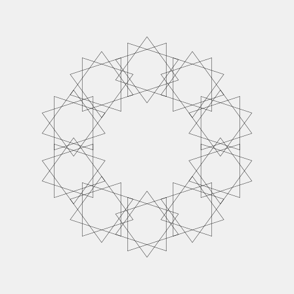
    <figcaption class="num">016</figcaption>
  </figure>
  <figure class="m4">
    
    <figcaption class="num">017</figcaption>
  </figure>
  <figure class="m4">
    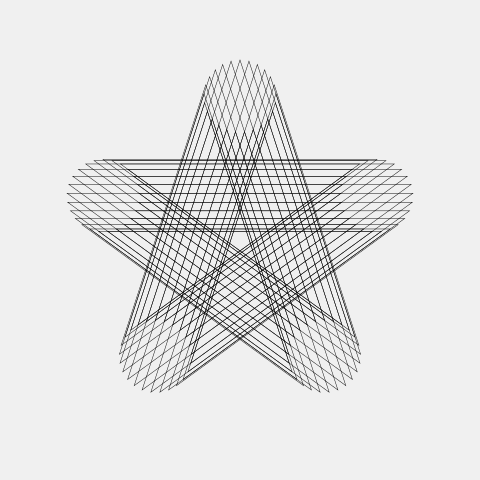
    <figcaption class="num">018</figcaption>
  </figure>
  <figure class="m4">
    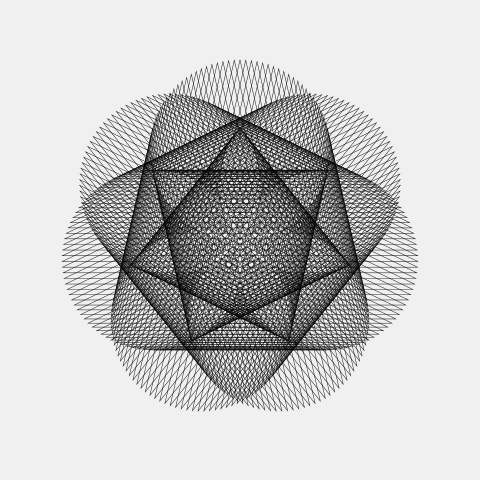
    <figcaption class="num">019</figcaption>
  </figure>
</section>

## COMPOSITION 2
<section class="grid">
  <figure class="m4">
    
    <figcaption class="num">020</figcaption>
  </figure>
  <figure class="m4">
    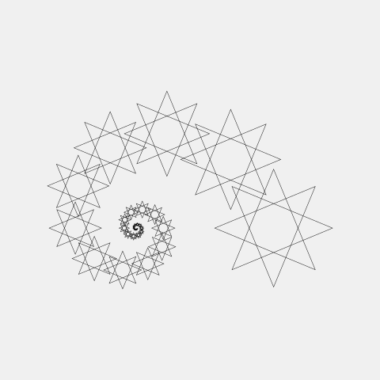
    <figcaption class="num">021</figcaption>
  </figure>
  <figure class="m4">
    
    <figcaption class="num">022</figcaption>
  </figure>
  <figure class="m4">
    
    <figcaption class="num">023</figcaption>
  </figure>
  <figure class="m4">
    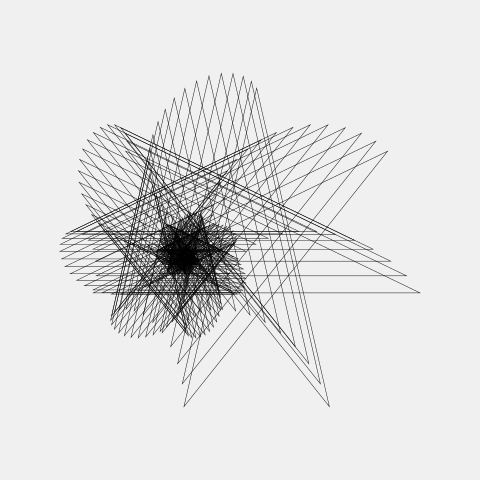
    <figcaption class="num">024</figcaption>
  </figure>
  <figure class="m4">
    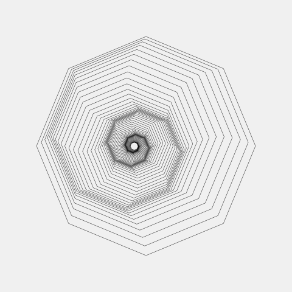
    <figcaption class="num">025</figcaption>
  </figure>
</section>

## JOLIGONES
<section class="grid">
  <figure class="m3">
    
    <figcaption class="num">026</figcaption>
  </figure>
  <figure class="m3">
    
    <figcaption class="num">027</figcaption>
  </figure>
  <figure class="m3">
    
    <figcaption class="num">028</figcaption>
  </figure>
  <figure class="m3">
    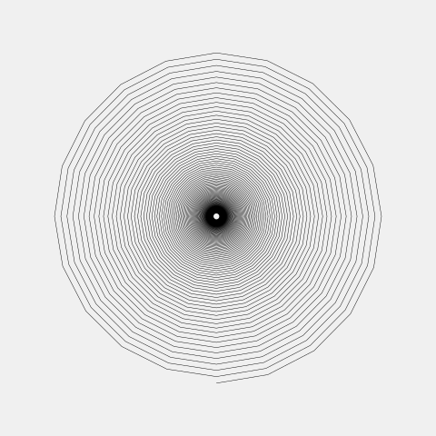
    <figcaption class="num">029</figcaption>
  </figure>
  <figure class="m3">
    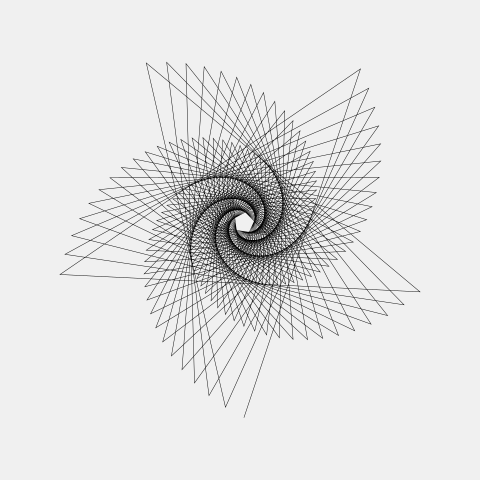
    <figcaption class="num">030</figcaption>
  </figure>
  <figure class="m3">
    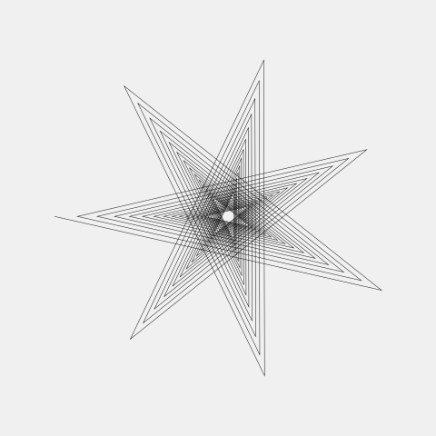
    <figcaption class="num">031</figcaption>
  </figure>
  <figure class="m3">
    
    <figcaption class="num">032</figcaption>
  </figure>
  <figure class="m3">
    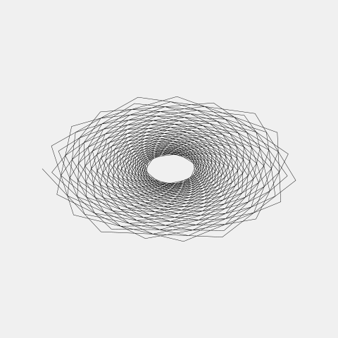
    <figcaption class="num">033</figcaption>
  </figure>
</section>

## CHEVAL
<section class="grid">
  <figure class="m4">
    
    <figcaption class="num">034</figcaption>
  </figure>
  <figure class="m4">
    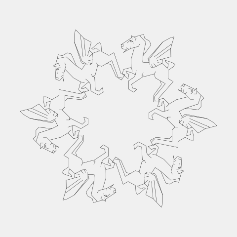
    <figcaption class="num">035</figcaption>
  </figure>
  <figure class="m4">
    
    <figcaption class="num">036</figcaption>
  </figure>
  <figure class="m4">
    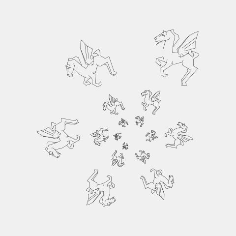
    <figcaption class="num">037</figcaption>
  </figure>
  <figure class="m8">
    
    <figcaption class="num">038</figcaption>
  </figure>
  <figure class="m4">
    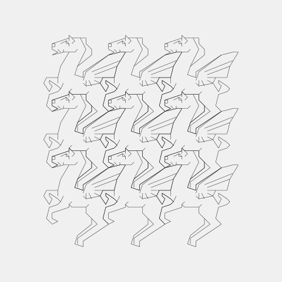
    <figcaption class="num">039</figcaption>
  </figure>
  <figure class="m9">
    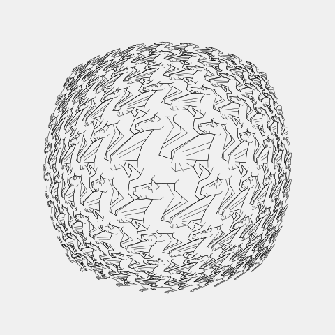
    <figcaption class="num">042</figcaption>
  </figure>
  <figure class="m3">
    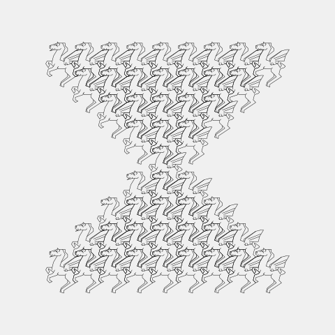
    <figcaption class="num">040</figcaption>
  </figure>
  <figure class="m3">
    
    <figcaption class="num">041</figcaption>
  </figure>
  <figure class="m3">
    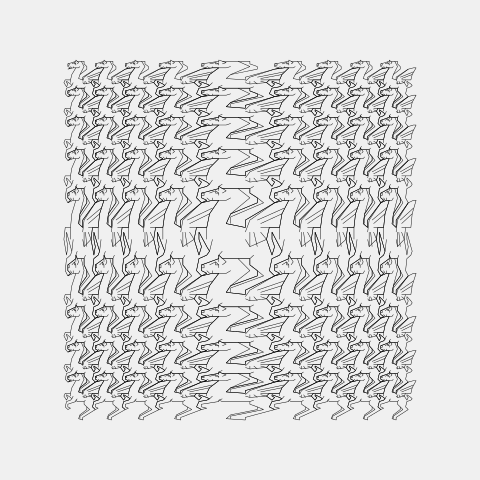
    <figcaption class="num">043</figcaption>
  </figure>
</section>

## LION
<section class="grid">
  <figure class="m6">
    
    <figcaption class="num">044</figcaption>
  </figure>
  <figure class="m6">
    
    <figcaption class="num">045</figcaption>
  </figure>
</section>

## OISEAUX-POISSONS
<section class="grid">
  <figure class="m6">
    
    <figcaption class="num">046</figcaption>
  </figure>
  <figure class="m6">
    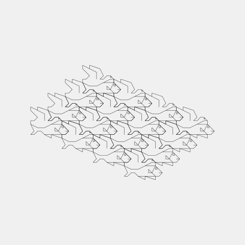
    <figcaption class="num">047</figcaption>
  </figure>
</section>

## SMURF
<section class="grid">
  <figure class="m6">
    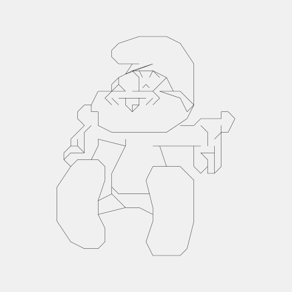
    <figcaption class="num">048</figcaption>
  </figure>
  <figure class="m6">
    
    <figcaption class="num">049</figcaption>
  </figure>
</section>

## DRAGONS
<section class="grid">
  <figure class="m6">
    
    <figcaption class="num">050</figcaption>
  </figure>
  <figure class="m6">
    
    <figcaption class="num">051</figcaption>
  </figure>
  <figure class="m12">
    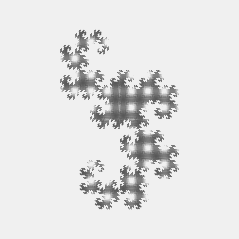
    <figcaption class="num">052</figcaption>
  </figure>
</section>

## Bonus
<section class="grid">
  <figure class="m12">
    
    <figcaption class="num">I</figcaption>
  </figure>
  <figure class="m12">
    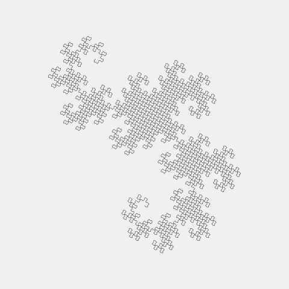
    <figcaption class="num">II</figcaption>
  </figure>
  <figure class="m12">
    
    <figcaption class="num">III</figcaption>
  </figure>
  <figure class="m12">
    
    <figcaption class="num">IV</figcaption>
  </figure>
  <figure class="m12">
    
    <figcaption class="num">V</figcaption>
  </figure>
</section>

